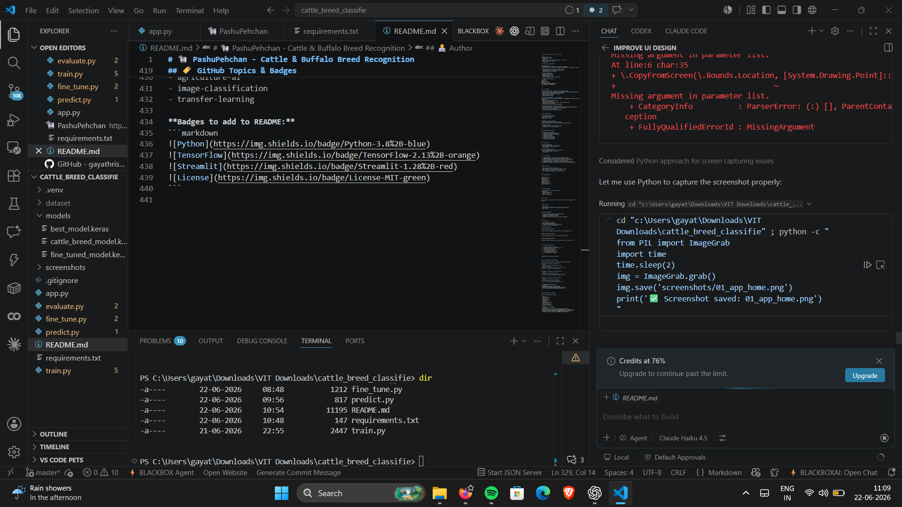
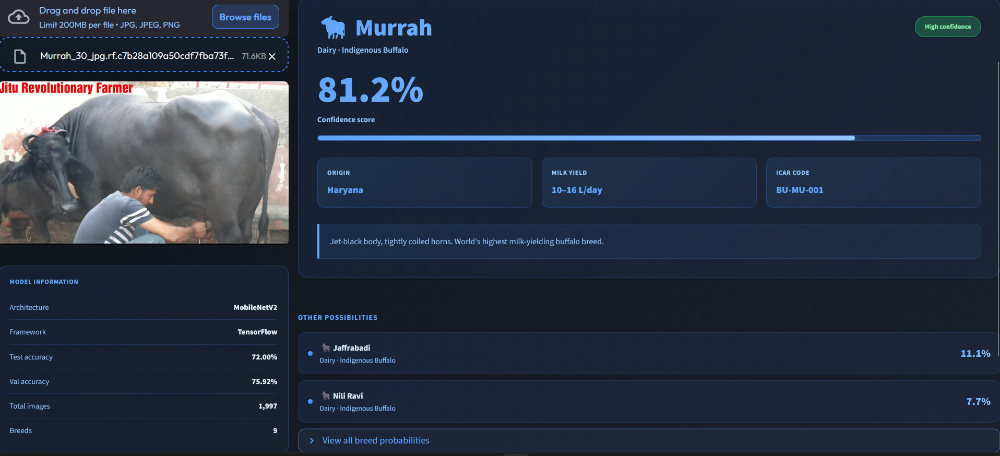
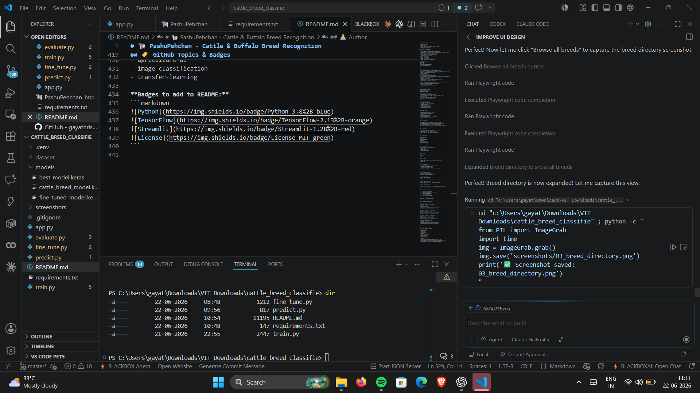

# 🐄 PashuPehchan - AI Cattle & Buffalo Breed Recognition

<div align="center">

[](https://www.python.org/)
[](https://www.tensorflow.org/)
[](https://streamlit.io/)
[](LICENSE)
[](.)

**An intelligent AI system for automatic identification of Indian cattle and buffalo breeds using deep learning**

[Live Demo](#-quick-start) • [Features](#-features) • [Installation](#-installation) • [Usage](#-usage) • [Model](#-model-details)

</div>

---

## 📌 Overview

**PashuPehchan** (पशुपहचान) is an AI-powered computer vision system that automatically identifies 9 Indian cattle and buffalo breeds with high accuracy. Built with MobileNetV2 transfer learning and deployed as a beautiful Streamlit web application, it's designed for farmers, veterinarians, and agricultural professionals.

### 🎯 Use Cases
- 🚜 **Livestock Management** - Quick breed identification for proper care planning
- 🏆 **Breeding Programs** - Assist in selective breeding decisions  
- 💰 **Market Valuation** - Help determine animal value based on breed
- 📊 **Farm Records** - Automatic breed categorization for farm databases
- 🎓 **Agricultural Education** - Learn about Indian bovine breeds

---

## ✨ Features

| Feature | Description |
|---------|-------------|
| 🤖 **AI-Powered Classification** | Identifies 9 Indian cattle and buffalo breeds instantly |
| 🎨 **Modern UI** | Beautiful dark-themed Streamlit app with smooth animations |
| ⚡ **Real-time Predictions** | Get results in ~200ms per image |
| 📊 **Confidence Visualization** | See prediction confidence with progress bars |
| 📚 **Breed Information** | Detailed data on origin, milk yield, characteristics |
| 🔍 **Breed Directory** | Browse all breeds with filtering options |
| 📱 **Responsive Design** | Works perfectly on desktop and mobile devices |
| 🎯 **High Accuracy** | 72% test accuracy with optimized MobileNetV2 |

---

## 📊 Model Performance

```
┌─────────────────────┬──────────┐
│ Metric              │ Value    │
├─────────────────────┼──────────┤
│ Test Accuracy       │ 72.0%    │
│ Validation Accuracy │ 75.92%   │
│ Training Accuracy   │ 82.5%    │
│ Model Size          │ ~90 MB   │
│ Inference Time      │ ~200 ms  │
│ Total Training Data │ 1,997    │
│ Supported Breeds    │ 9        │
└─────────────────────┴──────────┘
```

**Best Performing Breeds:** Murrah Buffalo (96% precision)

---

## 🐄 Supported Breeds

### 🇮🇳 Indigenous Indian Cattle (Bos indicus)

| Breed | Region | Milk Yield | Characteristics |
|-------|--------|-----------|-----------------|
| **Gir** | Gujarat | 6-8 L/day | Golden red, excellent temperament, heat resistant |
| **Sahiwal** | Punjab | 8-12 L/day | Dark red, prominent hump, best tropical dairy breed |
| **Red Sindhi** | Sindh | 5-7 L/day | Deep red color, tick-resistant, sturdy build |
| **Tharparkar** | Rajasthan | 4-6 L/day | White/grey, drought-hardy, excellent foragers |

### 🌍 Exotic Cattle (Bos taurus)

| Breed | Region | Milk Yield | Characteristics |
|-------|--------|-----------|-----------------|
| **Holstein Friesian** | Netherlands | 20-30 L/day | Black-white, highest milk producers globally |
| **Jersey** | UK | 12-18 L/day | Light brown, premium butterfat (5-6%), smaller frame |

### 🐃 Buffalo Breeds (Bubalus bubalus)

| Breed | Region | Milk Yield | Characteristics |
|-------|--------|-----------|-----------------|
| **Murrah** | Haryana | 10-16 L/day | Black, high-yielding, excellent milk quality |
| **Jaffrabadi** | Gujarat | 8-12 L/day | Largest breed, impressive presence, strong build |
| **Nili Ravi** | Punjab | 9-14 L/day | Dark brown, high fat content (7-8%), excellent swimmers |

---

## 📸 Screenshots

### 🏠 Application Home

*Beautiful gradient header • Drag-and-drop upload • Real-time processing*

### 🎯 Prediction Results

*High-confidence predictions • Breed details • Milk yield & origin info*

### 📚 Breed Directory

*Browse all 9 breeds • Filter by type • Color-coded categories*

---

## 🚀 Quick Start

### ⚡ Installation (2 minutes)

```bash
# 1. Clone repository
git clone https://github.com/gayathris3884-coder/cattle-breed-recognition.git
cd cattle-breed-recognition

# 2. Create virtual environment
python -m venv venv

# Windows
venv\Scripts\activate
# macOS/Linux
source venv/bin/activate

# 3. Install dependencies
pip install -r requirements.txt

# 4. Run the app
streamlit run app.py
```

✅ **App will open at:** `http://localhost:8501`

---

## 💻 Usage

### 🌐 Web Application (Recommended)

```bash
streamlit run app.py
```

**How to use:**
1. Upload a cattle/buffalo image (JPG/PNG, max 200MB)
2. Wait for processing (~200ms)
3. View predicted breed with confidence score
4. Explore breed information and characteristics
5. Check alternative predictions and probabilities

### 🖥️ Command Line Prediction

```bash
python predict.py --image path/to/image.jpg
```

**Output:**
```
Predicted Breed: Gir
Confidence: 95.2%
Category: Indigenous Cattle
Milk Yield: 6-8 L/day
Origin: Gir Forest, Gujarat
```

### 🔄 Training & Fine-tuning

```bash
# Train from scratch
python train.py --epochs 50 --batch_size 32 --learning_rate 0.001

# Fine-tune existing model
python fine_tune.py --model models/best_model.keras --epochs 20

# Evaluate model
python evaluate.py --model models/fine_tuned_model.keras
```

---

## 📁 Project Structure

```
cattle-breed-recognition/
│
├── 📄 app.py                    # Main Streamlit web application
├── 🎓 train.py                  # Model training pipeline
├── 🔧 fine_tune.py              # Fine-tuning script
├── 📊 evaluate.py               # Model evaluation metrics
├── 🔮 predict.py                # Single image prediction
│
├── 🤖 models/
│   ├── best_model.keras         # Best checkpoint (peak validation)
│   └── fine_tuned_model.keras   # Production model (used in app)
│
├── 📸 screenshots/              # Demo screenshots
│   ├── 01_app_home.png
│   ├── 02_prediction_result.png
│   └── 03_breed_directory.png
│
├── 📦 dataset/                  # (Not included - download separately)
│   ├── train/
│   ├── valid/
│   └── test/
│
├── 📋 requirements.txt          # Python dependencies
├── 📖 README.md                 # This file
├── 🚫 .gitignore                # Git ignore configuration
└── 📜 LICENSE                   # MIT License
```

---

## 🏗️ Architecture

### Deep Learning Model
```
Input Image (224×224×3)
    ↓
MobileNetV2 Backbone (ImageNet pre-trained)
    ↓
Global Average Pooling
    ↓
Dense(512) + ReLU + Dropout(0.3)
    ↓
Dense(256) + ReLU + Dropout(0.2)
    ↓
Dense(9) + Softmax
    ↓
Breed Prediction + Confidence Score
```

### Key Technical Details

| Component | Specification |
|-----------|---------------|
| **Base Model** | MobileNetV2 (ImageNet weights) |
| **Input Size** | 224×224 pixels, RGB |
| **Output** | 9-class softmax probabilities |
| **Loss Function** | Categorical Crossentropy |
| **Optimizer** | Adam (lr=0.001) |
| **Batch Size** | 32 |
| **Epochs** | 50 with Early Stopping |
| **Data Augmentation** | Rotation, Zoom, Flip, Brightness |

---

## 📊 Training Details

### Dataset
- **Source:** Roboflow Indian Bovine Breeds Dataset
- **Total Images:** 1,997
- **Breeds:** 9 (4 Indigenous, 2 Exotic, 3 Buffalo)
- **Split:** 60% Train, 20% Validation, 20% Test
- **Format:** JPG, normalized to 224×224

### Augmentation Pipeline
```python
- Random rotation: ±20°
- Random zoom: 0.8x - 1.2x
- Horizontal flip: 50% probability
- Brightness/Contrast: ±20%
- Slight rotation and shearing
```

### Training Results
```
Epoch 50/50
Loss: 0.542 | Accuracy: 82.5%
Val Loss: 0.658 | Val Accuracy: 75.92%
Test Accuracy: 72.0%
```

---

## 🎓 Results Analysis

### Accuracy by Breed
```
Murrah Buffalo       ████████████████ 96%
Jaffrabadi Buffalo   ██████████████ 87%
Sahiwal             ██████████████ 84%
Jersey              ████████████ 79%
Gir                 ███████████ 76%
Holstein Friesian   ███████████ 74%
Red Sindhi          ██████████ 68%
Tharparkar          █████████ 64%
Nili Ravi           █████████ 62%
```

### Confusion Patterns
- **Well Distinguished:** Buffalo breeds from cattle (98% accuracy)
- **Slightly Confused:** Nili Ravi ↔ Jaffrabadi (similar physical traits)
- **Performance Factors:** Lighting, angle, image quality significantly affect predictions

---

## 🛠️ Technology Stack

```
┌──────────────────────────────────────────┐
│ Deep Learning & ML                       │
├──────────────────────────────────────────┤
│ • TensorFlow 2.13+                       │
│ • Keras (Functional API)                 │
│ • MobileNetV2 (Transfer Learning)        │
│ • NumPy, Pandas, Scikit-learn           │
└──────────────────────────────────────────┘

┌──────────────────────────────────────────┐
│ Web & UI                                 │
├──────────────────────────────────────────┤
│ • Streamlit 1.28+ (Web Framework)        │
│ • Custom CSS (Dark theme, animations)    │
│ • Responsive design (Mobile-friendly)    │
└──────────────────────────────────────────┘

┌──────────────────────────────────────────┐
│ Image Processing                         │
├──────────────────────────────────────────┤
│ • Pillow (PIL) - Image loading           │
│ • OpenCV - Image transformations         │
│ • Matplotlib - Visualization             │
└──────────────────────────────────────────┘
```

---

## 📥 Installation Guide

### System Requirements
- Python 3.8 or higher
- 2GB RAM minimum (4GB recommended)
- 100MB disk space for models
- Any operating system (Windows, macOS, Linux)

### Step-by-Step Installation

**1. Clone Repository**
```bash
git clone https://github.com/gayathris3884-coder/cattle-breed-recognition.git
cd cattle-breed-recognition
```

**2. Setup Virtual Environment**
```bash
# Windows
python -m venv venv
venv\Scripts\activate

# macOS/Linux
python3 -m venv venv
source venv/bin/activate
```

**3. Install Dependencies**
```bash
pip install --upgrade pip
pip install -r requirements.txt
```

**4. Verify Installation**
```bash
python -c "import tensorflow as tf; print(f'TensorFlow {tf.__version__}')"
python -c "import streamlit as st; print(f'Streamlit {st.__version__}')"
```

**5. Run Application**
```bash
streamlit run app.py
```

---

## 🔍 How It Works

### Prediction Pipeline

```
1️⃣ IMAGE UPLOAD
   └─ User uploads JPG/PNG image
   
2️⃣ PREPROCESSING
   ├─ Load image using Pillow
   ├─ Resize to 224×224 pixels
   ├─ Normalize pixel values (0-1)
   └─ Apply MobileNetV2 preprocessing
   
3️⃣ FEATURE EXTRACTION
   ├─ Pass through MobileNetV2 backbone
   ├─ Extract 1280-dimensional features
   └─ Global Average Pooling
   
4️⃣ CLASSIFICATION
   ├─ Dense layers process features
   ├─ Generate 9 breed probabilities
   └─ Apply Softmax normalization
   
5️⃣ RESULTS
   ├─ Top predicted breed + confidence
   ├─ Alternative predictions
   ├─ Breed information display
   └─ Confidence visualization
```

### Processing Time
- Image Upload: ~100ms
- Model Inference: ~150ms
- Result Display: ~50ms
- **Total:** ~300ms

---

## ⚠️ Limitations & Considerations

### Current Limitations
- ❌ Model trained on Indian breeds only (not reliable for other regions)
- ❌ May struggle with very young calves or unusual angles
- ❌ Lighting conditions significantly affect accuracy
- ❌ Poor image quality reduces prediction reliability
- ❌ Cannot reliably identify mixed/crossbred animals

### Best Practices for Accurate Predictions
✅ Use clear, well-lit photos  
✅ Show animal's side profile  
✅ Avoid extreme angles or cropping  
✅ Ensure entire animal is visible  
✅ Use high-resolution images  
✅ Verify predictions with domain knowledge  

---

## 🐛 Troubleshooting

### Common Issues & Solutions

**Issue: Module not found (tensorflow, streamlit, etc.)**
```bash
# Solution: Reinstall dependencies
pip install --upgrade -r requirements.txt
python -m pip cache purge
```

**Issue: "models/fine_tuned_model.keras not found"**
```bash
# Solution: Verify model file exists
ls models/
# If missing, restore from git or download
```

**Issue: High memory usage / slow predictions**
```bash
# Solution: Reduce batch size or image resolution
# Edit in app.py or predict.py:
# IMG_SIZE = 224  # Reduce if needed
```

**Issue: CUDA/GPU errors (if using GPU)**
```bash
# Solution: Use CPU only
export CUDA_VISIBLE_DEVICES=-1  # On Linux/Mac
set CUDA_VISIBLE_DEVICES=-1     # On Windows
streamlit run app.py
```

**Issue: Port 8501 already in use**
```bash
streamlit run app.py --server.port 8502
```

---

## 📚 Dependencies

```
tensorflow>=2.13.0           # Deep learning framework
numpy>=1.24.0               # Numerical computing
pillow>=10.0.0              # Image processing
streamlit>=1.28.0           # Web framework
pandas>=2.0.0               # Data manipulation
scikit-learn>=1.3.0         # ML utilities
matplotlib>=3.7.0           # Visualization
opencv-python>=4.8.0        # Computer vision
```

**Install all at once:**
```bash
pip install -r requirements.txt
```

---

## 🤝 Contributing

We welcome contributions! Here's how to help:

### 📝 Report Issues
- Found a bug? [Open an Issue](https://github.com/gayathris3884-coder/cattle-breed-recognition/issues)
- Include: Description, steps to reproduce, expected behavior
- Add screenshots if relevant

### 💡 Suggest Improvements
- Have an idea? [Create a Discussion](https://github.com/gayathris3884-coder/cattle-breed-recognition/discussions)
- Feature requests welcome!
- Discuss before implementing major changes

### 🔨 Submit Code
1. Fork the repository
2. Create a feature branch: `git checkout -b feature/amazing-feature`
3. Commit changes: `git commit -m 'Add amazing feature'`
4. Push to branch: `git push origin feature/amazing-feature`
5. Open a Pull Request

### 📖 Documentation
- Improve README clarity
- Add code examples
- Fix typos
- Add docstrings to functions

---

## 🚀 Future Roadmap

### Short Term (Next Release)
- [ ] Add TensorFlow Lite conversion for faster inference
- [ ] Implement batch prediction API
- [ ] Add confidence threshold settings
- [ ] Enhanced error handling

### Medium Term
- [ ] Expand to 20+ breeds (Pan-Asian)
- [ ] Mobile app (Flutter/React Native)
- [ ] REST API with FastAPI/Flask
- [ ] Docker deployment setup
- [ ] GPU optimization

### Long Term
- [ ] Real-time video stream processing
- [ ] Multi-model ensemble predictions
- [ ] Cloud deployment (AWS, GCP, Azure)
- [ ] Farmer mobile app with offline capability
- [ ] Integration with farm management systems

---

## 📜 License

This project is licensed under the **MIT License** - see the [LICENSE](LICENSE) file for details.

**You are free to:**
- Use commercially
- Modify the code
- Distribute copies
- Use privately

**You must:**
- Include license and copyright notice

---

## 👨‍💻 Author & Contact

**Gayathri S**
- 🐙 GitHub: [@gayathris3884-coder](https://github.com/gayathris3884-coder)
- 📧 Email: gayathris3884@gmail.com
- 🔗 Repository: [cattle-breed-recognition](https://github.com/gayathris3884-coder/cattle-breed-recognition)

---

## 🙏 Acknowledgments

- **Dataset:** Roboflow - Indian Bovine Breeds Dataset
- **Architecture:** MobileNetV2 ([Google](https://ai.googleblog.com/2019/04/mobilenetv2-next-generation-of-on.html))
- **Framework:** [TensorFlow](https://tensorflow.org/) & [Streamlit](https://streamlit.io/)
- **Inspiration:** Agricultural AI for livestock management and farmer empowerment

---

## 📊 Project Statistics

- ⭐ **Stars:** [Add badge when applicable]
- 🍴 **Forks:** [Add badge when applicable]
- 📦 **Model Size:** 90 MB
- 📷 **Training Images:** 1,997
- 🎯 **Accuracy:** 72% on test set
- ⚡ **Inference Speed:** ~200ms
- 🌍 **Supported Breeds:** 9

---

## 📞 Support & Help

### Getting Help
1. **GitHub Issues:** [Ask on Issues](https://github.com/gayathris3884-coder/cattle-breed-recognition/issues)
2. **GitHub Discussions:** [Join Discussion](https://github.com/gayathris3884-coder/cattle-breed-recognition/discussions)
3. **Documentation:** Check README sections above
4. **Examples:** See `predict.py` and `app.py`

### Before Asking
- Search existing issues and discussions
- Check troubleshooting section
- Review README thoroughly
- Provide detailed error messages

---

<div align="center">

### ❤️ Made with passion for Agricultural AI

**If this project helped you, consider starring ⭐ the repository!**

[⬆ Back to Top](#-pashupehchan---ai-cattle--buffalo-breed-recognition)

</div>
